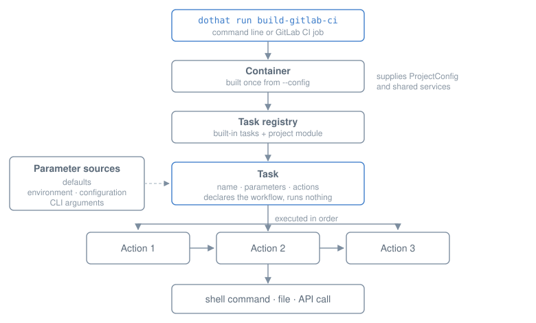

gcip2
=====

**gcip2** is a Python DSL for building GitLab CI/CD pipelines from strongly typed
Pydantic models, and for running the automation those pipelines invoke.

Instead of maintaining large YAML files, pipelines are described in Python, validated
against the official GitLab CI schema, and rendered to GitLab-compatible YAML. The same
project defines *tasks* — named automation workflows that run identically from the
command line and from a CI job.

.. toctree::
   :maxdepth: 1
   :hidden:

   self
   usage
   api
   changelog

Installation
------------

.. code-block:: bash

   uv add gcip2

Quick start
-----------

.. code-block:: bash

   dothat run init            # generate a minimal project
   dothat run build-gitlab-ci # render .gitlab-ci.yml
   dothat run build-pipeline  # render out/pipeline.gitlab-ci.yml

``dothat run init`` creates:

.. code-block:: text

   .
   ├── ci.py                    # pipeline and job definitions
   ├── environment.toml         # project configuration
   ├── pyproject.toml
   └── .pre-commit-config.yaml

How a task runs
---------------

A task declares *what* should happen; actions implement *how*. Everything below the CLI
receives its configuration and services from a single container, so the same task
definition works locally and in CI without duplicated logic.

Where to go next
----------------

.. list-table::
   :widths: 30 70

   * - :doc:`usage/tasks`
     - Defining tasks, actions, and parameters
   * - :doc:`usage/pipeline`
     - Writing pipelines and jobs
   * - :doc:`usage/di`
     - How configuration and services reach your code
   * - :doc:`api`
     - Generated reference for every module

Links
-----

* `GitLab CI schema <https://gitlab.com/gitlab-org/gitlab-foss/-/raw/master/app/assets/javascripts/editor/schema/ci.json>`_
* `GitLab CI documentation <https://docs.gitlab.com/ci/>`_
* `Licence <https://gl.pivlab.space/rnd/gcip2/-/blob/master/LICENCE.md>`_
